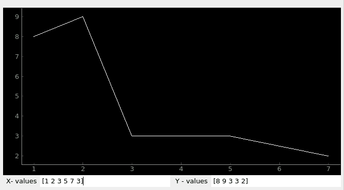

========================
Local Plugin
========================

PyDM uses Data Plugins as sources of information to be displayed at the widgets.
Local Data Plugin allows users to create and use local variables.

The Local Data Plugin stores the data that is sent by the widgets through a channel, and broadcasts it to all the listeners connected to this particular local variable channel.

By default, as soon as any widgets gets connected to the same channel variable, they will get the initial values that were defined in the channel's address. These widgets can receive any updates when the data changes, or they can send data back.
For example, if the user has added a Local Variable channel to a PyDMEditLine, then all the widgets connected to this Local Variable will get the values that are updated by the user in the PyDMEditLine.

General Local Plugin channel syntax::

	loc://my_variable_name?type=variable_type&init=initial_values

.. note:: Once a Local Variable channel is created, multiple widgets can be connected to the same channel by providing the name of the variable, like so:
	::

		loc://my_variable_name

-------------

.. _Required Attributes:

Required Attributes
-------------------

In order to be able to properly create a Local Variable channel, all the :ref:`required attributes<required attributes table>` must be provided in the channel's address.

.. _required attributes table:

The table below explains the attributes that are required to create a local plugin channel:

=========== ================================================== ========================
Attributes  Description                                        Format Example
=========== ================================================== ========================
**loc**     protocol name for Local Data Plugin                `loc://`
**name**    | the identifier for a local variable              `my_ndarray_var`
            | user's choice
**type**    | data-type for this variable                      `type=array`
  	    | refer to :ref:`Variable Types<Variable Types>`
            | for more info of acceptable type
**init**    initial values to be used                          `init=[1,2,3,4]`
=========== ================================================== ========================

Here is a simple example of a channel address format with the required attributes:
::

	loc://my_np.array?type=array&init=[1,2,3,4]

.. note:: Please reference :ref:`Variable Types<Variable Types>` section for more information about local variables types.

-------------

.. _Local Plugin Extra Attributes:

Extra Attributes
----------------

Along with the :ref:`required attributes<Required Attributes>`, the Local Data Plugin can also accept some optional attributes to configure the Local Variables with.
The optional attributes are described in the :ref:`extra attributes<extra attributes table>` table below:

.. _extra attributes table:

The table below explains the optional attributes that can go in the *extras*:

=============== =================================== ============ =================================
Attributes      Description                         Type         Format Example
=============== =================================== ============ =================================
**precision**   precision of float values           int          `precision=3`
**unit**        units for the data                  string       `unit=V`
**upper_limit** upper control value limit           float or int `upper_limit=100`
**lower_limit** lower control value limit           float or int `lower_limit=-100`
**enum_string** new list of values                  tuple        `enum_string=['hey', 'hello']`
=============== =================================== ============ =================================

.. note:: All the additional attributes are optional, any number of desired attributes can be specified, or none.

Here is a simple example of a channel address format with some optional attributes:
::

	loc://my.float?type=float&init=1&precision=3&unit=V

-------------

.. _Variable Types:

Variable Types
----------------

Local Data Plugin supports the following types:

- **int**
- **float**
- **bool**
- **str**
- **array** - this will be treated as a numpy.ndarray type

Arrays
######

.. note:: Arrays will be constructed using **numpy.array** built in function. See `numpy.array <https://numpy.org/doc/1.18/reference/generated/numpy.array.html#numpy.array>`_ for more information on how to construct an array.

The following option must be specified in the "type" value in the channel address:

* `type=array`

The following extra attributes can be specified. These attributes will be passed in the `numpy.array` function as parameters when creating the `numpy.ndarray`. If no attributes are specified, the `numpy.array` function will use the default values to create a `numpy.ndarray`.

* Extra Attributes for numpy.array:

=============== =================================== ============= =============================
Attributes      Description                         Type          Format Example
=============== =================================== ============= =============================
**dtype**       desired data-type for the array     np.dtype      | `dtype=float64`
                                                                  | `dtype=uint8`
**copy**        if *True* then the object is copied bool          `copy=true` (*default*)
**order**       memory layout of the array          string        | `order=K` (*default*)
                                                                  | others {'A', 'C', 'F'}
**subok**       | if *True* then sub-classes        bool          `subok=false` (*default*)
                | will be passed-through
**ndmin**       minimum number of dimensions        int           `ndmin=0` (*default*)
=============== =================================== ============= =============================

Here is a simple example with array + extras:
::

	 loc://my_ndarray?type=array&init=[1,2,3,2]&dtype=float64&copy=False&order=C&ndmin=0&subok=true

------------

Simple Local Data Plugin Example
---------------------------------

The picture below represents a simple example using the Local Data Plugin, where a Waveform Curve Editor has two local data plugin channels::

	loc://y?type=array&init=[1,2,3,4,5,6]&dtype=float64

	loc://x?type=array&init=[1,2,3,4,5,6]&dtype=float64

Right below the Waveform Curve Editor widget, there are two other widgets connected to the 'x' and 'y' local variable respectively::

	X-values: loc://x
	Y-values: loc://y

Data can be updated in the two X and Y-values widgets and the Waveform Curve Editor will receive the new data and change the curve accordingly, like seen in the picture below:

*Waveform Curve Example with ndarrays for X and Y values*

---------------

Miscellaneous
-------------

* If precision is not set through the "extras", and it is set to receive the precision from the PV (Process Variable), the Local Data Plugin will match the precision from the values inserted by the users in the widgets.
